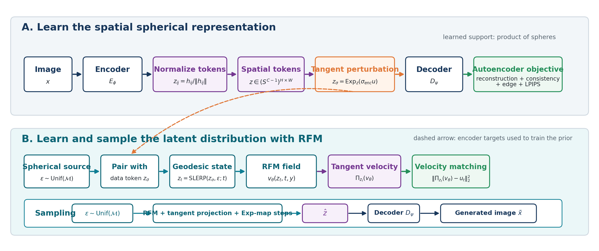
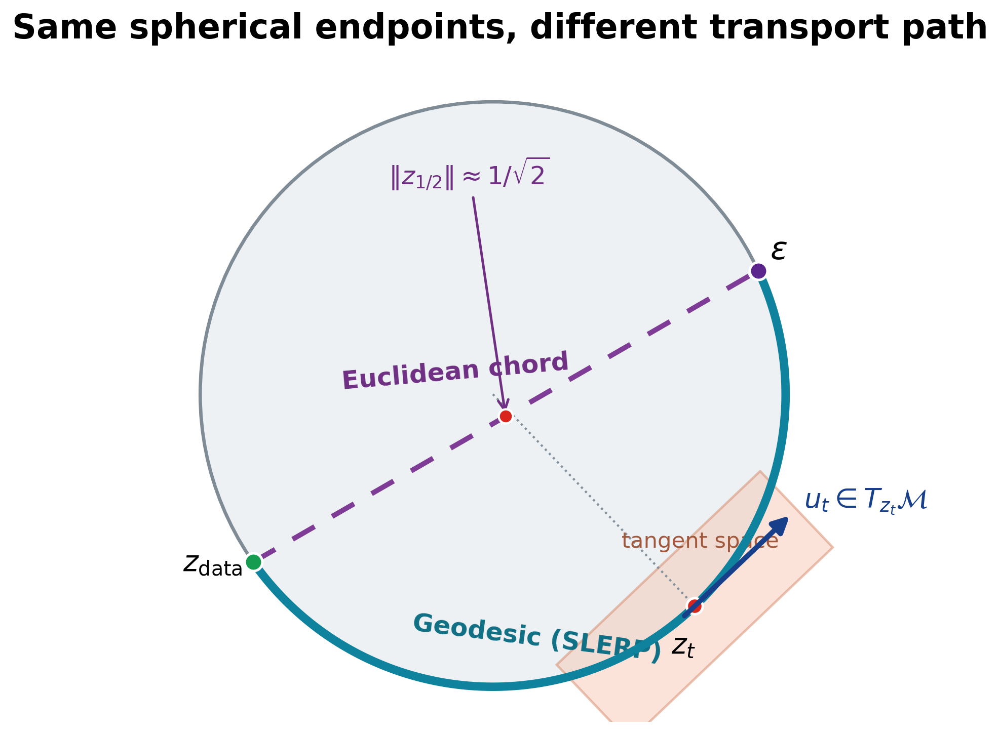
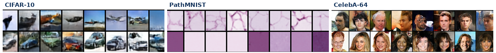

# SRUL: Spatial Spherical Latents with Riemannian Flow Matching

SRUL is a course research project on latent generative modeling. Autoencoders are often paired with Gaussian priors and Euclidean transport, although their learned latent geometry is not necessarily Gaussian. Depending on the architecture, normalization, and training objective, encoded features can instead concentrate near a fixed-radius shell. Transformer autoencoders with LayerNorm are one common example, not a requirement. For these latents, a Gaussian source adds radial variation that the representation does not use, while linear Euclidean interpolation cuts through the shell and creates off-manifold states. SRUL makes the spherical structure exact with a spatial grid of unit-norm tokens and learns their distribution using Riemannian Flow Matching (RFM) on the same product-of-spheres manifold.

The central controlled question is:

> When normalized encoder tokens have fixed radius, should the prior move through the interior with a Euclidean chord or along the surface with a geodesic path?



## Main result

The primary CIFAR-10 comparison fixes the spherical encoder, decoder, source distribution, latent size, prior capacity, and training budget. Only the probability path changes.

| Method | FID ↓ | KID ↓ | Precision ↑ | Recall ↑ | Minimum token norm ↑ |
|---|---:|---:|---:|---:|---:|
| Chord baseline | 67.44 | 0.0740 | 0.840 | 0.085 | 0.705 |
| **SRUL (geodesic RFM)** | **63.84** | **0.0667** | **0.857** | **0.091** | **1.000** |



## Controls

### Tangent-noise scale

The encoder-noise sweep trains a separate prior for each value of `sigma_enc`.

| `sigma_enc` | Reconstruction FID ↓ | Generation FID ↓ |
|---:|---:|---:|
| **0.05** | **17.53** | **48.71** |
| 0.15 | 19.56 | 51.61 |
| 0.30 | 27.85 | 58.16 |

### Classifier-free guidance

| CFG scale | FID ↓ | Precision ↑ | Recall ↑ |
|---:|---:|---:|---:|
| 1.0 | 62.44 | 0.854 | **0.083** |
| 1.5 | 54.83 | 0.865 | 0.071 |
| **2.0** | **49.39** | **0.884** | 0.059 |

## Cross-domain evaluation

CIFAR-10 provides the controlled geometry and sampling ablations. PathMNIST evaluates transfer to histopathology textures. CelebA-64 evaluates the larger `64x64` setting with an `8x8` latent-token grid.

| Dataset | Image size | Token grid | Reconstruction FID ↓ | Generation FID ↓ | Precision ↑ | Recall ↑ |
|---|---:|---:|---:|---:|---:|---:|
| CIFAR-10 | 32x32 | 4x4 | 17.53 | 48.71 | 0.861 | 0.090 |
| PathMNIST | 32x32 | 4x4 | 7.13 | 29.36 | 0.829 | 0.309 |
| CelebA-64 | 64x64 | 8x8 | 9.08 | 41.22 | 0.657 | 0.198 |



## Method summary

For every spatial token,

```text
h = Encoder(x)
z[i,j] = h[i,j] / ||h[i,j]||
```

Tangent noise changes direction without changing radius:

```text
u = ξ - <ξ,z>z
z_sigma = Exp_z(sigma_enc * u)
```

The prior follows tokenwise SLERP paths, predicts tangent velocities, and uses exponential-map integration during sampling. Class labels and classifier-free guidance are optional conditional inputs.

## Repository structure

```text
src/         Final training and evaluation scripts
scripts/     Reproducible command-line launchers
notebooks/   Colab quickstart notebook
results/     Final numerical tables
assets/      Pipeline, geometry, ablation, and sample figures
docs/        Method, experiments, and reproducibility notes
report/      Final report PDF and LaTeX source
slides/      Final 5-slide deck, PDF, and speaker script
archive/     Earlier development scripts and full experiment log
```

## Installation

```bash
python -m pip install -r requirements.txt
```

A CUDA GPU is strongly recommended. The scripts were developed for Google Colab and save resumable checkpoints when `--resume` is used.

## Quick smoke test

```bash
python src/srul_cifar_spatial_tokens_experiment.py \
  --dataset fake \
  --out-dir runs/smoke \
  --train-samples 256 \
  --test-samples 128 \
  --ae-epochs 1 \
  --prior-epochs 1 \
  --base-channels 16 \
  --latent-channels 8 \
  --prior-width 32 \
  --prior-depth 2 \
  --batch-size 32 \
  --methods chord rfm \
  --sample-steps 4 \
  --metric-samples 64 \
  --pr-samples 64 \
  --recon-metric-samples 64 \
  --skip-heavy-metrics
```

## Reproduce the main experiments

```bash
bash scripts/run_cifar10_geometry.sh /path/to/output/root
bash scripts/run_cifar10_conditional.sh /path/to/output/root /path/to/autoencoder_final.pt
bash scripts/run_cifar10_sigma_sweep.sh /path/to/output/root /path/to/autoencoder_final.pt
bash scripts/run_pathmnist.sh /path/to/output/root
bash scripts/run_celeba64.sh /path/to/output/root /path/to/dataset/cache
```

See [`docs/REPRODUCIBILITY.md`](docs/REPRODUCIBILITY.md) for full settings and expected outputs.

## Report and presentation

- [Final report](report/SRUL_Final_Report_v14.pdf)
- [Final slides](slides/SRUL_Final_5_Slides_v14.pdf)
- [Speaker script](slides/SRUL_5min_Speaker_Script_v14.md)

## Notes

- Checkpoints and datasets are excluded from Git because they are large.
- The main paper focuses on the controlled chord-versus-geodesic experiment.
- CelebA is subject to its dataset license and is intended for non-commercial research use.
